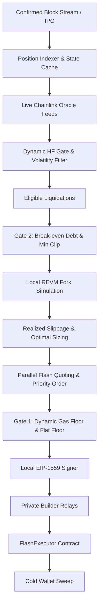

# Architecture

Deep technical specification of the Goshawk Ethereum Mainnet liquidation engine.

Goshawk is a specialized protocol liquidation system operating exclusively on Ethereum Mainnet (Chain ID 1). It enforces zero capital-at-risk execution by borrowing debt capital via uncollateralized flash loans, liquidating underwater borrow positions across supported lending protocols, swapping seized collateral back to the borrowed asset, and repaying the flash loan in a single atomic transaction.

## Evaluation and Execution Pipeline



## System Topology

```
goshawk/
├── bot/
│   ├── config/             # Ethereum TOML runtime configuration
│   └── src/
│       ├── chains/         # Lending market adapters (Aave, Morpho, Spark, Fluid, Compound, Euler)
│       ├── flash/          # Flash loan adapters (Morpho, Balancer, Spark DSS, Aave)
│       ├── swap/           # DEX execution venues (Uniswap V3, Curve, Balancer)
│       ├── shared/         # REVM simulation, gas oracle, mempool monitor
│       └── strategies/     # Liquidation dispatch and dual-gate sizing
├── contracts/              # FlashExecutor and ExecutorBase contracts (Foundry)
├── monitoring/             # Prometheus metrics and Grafana dashboards
├── scripts/                # Deployment, verification, and sweep scripts
└── docs/                   # System architecture, node setup, and whitepaper
```

## Trait Architecture

Goshawk decouples protocol mechanics from execution routines through three core traits:

### 1. LendingMarketAdapter

Defines position filtering, health factor evaluation, and calldata construction:

```rust
#[async_trait]
pub trait LendingMarketAdapter: Send + Sync {
    fn id(&self) -> &'static str;
    fn oracle_kind(&self) -> OracleKind;
    async fn refresh_positions(&self) -> Result<()>;
    async fn positions_below_hf(&self, threshold: f64) -> Vec<BorrowPosition>;
    async fn build_liquidation_calldata(
        &self,
        pos: &BorrowPosition,
        route: SwapRoute,
        min_profit: U256,
    ) -> Result<Bytes>;
}
```

- **Safety Gate:** Registration explicitly rejects any market reporting `OracleKind::SpotAmm` at boot. All in-scope protocols use `OracleKind::Chainlink`.
- **SVR Exclusion:** The Aave V3 adapter excludes Soft-Volatile Reserves (tBTC, AAVE) where liquidation spreads are constrained or volatile.

### 2. FlashLoanAdapter

Standardizes parallel depth and fee quoting across flash providers:

```rust
#[async_trait]
pub trait FlashLoanAdapter: Send + Sync {
    fn id(&self) -> &'static str;
    async fn quote_fee(&self, token: Address, amount: U256) -> Result<U256>;
    fn build_flash_call(&self, token: Address, amount: U256, inner_calldata: Bytes) -> Bytes;
}
```

Flash providers are attempted in strict fee order:
1. `morpho_blue` (0.00%)
2. `balancer_v2` (0.00%)
3. `spark_dss_flash` (0.00%)
4. `aave_v3` (0.05% fee backstop)

### 3. SwapVenueAdapter

Provides venue-agnostic quote derivation and swap calldata generation:

```rust
#[async_trait]
pub trait SwapVenueAdapter: Send + Sync {
    fn id(&self) -> &'static str;
    async fn quote(&self, token_in: Address, token_out: Address, amount_in: U256) -> Result<U256>;
    fn build_swap_call(&self, token_in: Address, token_out: Address, amount_in: U256, min_out: U256) -> Bytes;
}
```

Supported venues on Ethereum Mainnet: `uniswap_v3`, `curve`, `balancer`.

## Dynamic Threshold & Dual Independent Gates Engine

Operational thresholds are evaluated continuously per block:

### 1. Dual Independent Gates

Goshawk enforces two separate, non-waivable gates before dispatching a transaction:

- **Gate 1 (Profit Gate):**
  $$\text{Profit} \ge \max(C_{\text{gas}} \cdot \gamma + C_{\text{opp}}, \text{Floor}_{\text{flat}})$$
- **Gate 2 (Debt & Clip Gate):**
  $$\text{Debt} \ge \text{BreakEvenDebt}_{\text{protocol}} \quad \text{and} \quad \text{Debt} \ge \text{MinClip}_{\text{protocol}}$$

Clearing one gate does not waive the other.

### 2. Break-Even Sizing and Gas Regimes

Break-even debt thresholds account for Ethereum L1 base fees and priority tips:

- **Morpho Blue:** $900.00
- **Compound V3:** $1,200.00
- **Spark:** $2,333.33
- **Aave V3:** $2,700.00 (Normal: $770 debt / $5,000 clip; Spike >60 gwei: $5,600 debt / $25,000 clip for WBTC)
- **Fluid & Euler V2:** Fallback to flat floor ($750.00) pending market maturity

### 3. Volatility-Widened Health Factor Gate

During rapid market movements, liquidation competition intensifies. Goshawk monitors rolling standard deviations of oracle updates ($\sigma$) and widens the search gate:

$$HF_{\text{gate}} = HF_{\text{base}} + \min(\sigma \cdot \alpha, \Delta_{\max})$$

Where $HF_{\text{base}} = 1.03$, $\alpha = 1.50$, and $\Delta_{\max} = 0.05$.

### 4. Adaptive Cost-Weighted Circuit Breakers

The adaptive breaker weights revert penalties by realized gas loss:

$$P = \min\left(5, 1 + \frac{\text{Loss}_{\text{USD}}}{5}\right)$$

Breakers trip when the accumulated loss or weighted penalty exceeds threshold limits, resetting after 3 consecutive successful transactions.

## Smart Contract Architecture

The system executes through `FlashExecutor.sol`, inheriting from `ExecutorBase.sol`:

### Flash Callback Branches

`ExecutorBase` routes five flash loan callback interfaces into a single shared internal execution routine:

1. **Morpho Blue:** `onMorphoFlashLoan(uint256, bytes)`
2. **Balancer V2:** `receiveFlashLoan(IERC20[], uint256[], uint256[], bytes)`
3. **Spark DSS Flash (ERC-3156):** `onFlashLoan(address, address, uint256, uint256, bytes)`
4. **Aave V3:** `executeOperation(address, uint256, uint256, address, bytes)`
5. **Uniswap V3:** `uniswapV3FlashCallback(uint256, uint256, bytes)`

### Core Invariants

- **Chain ID Guard:** Reverts if deployed on or called from any chain other than Ethereum Mainnet (`block.chainid == 1`).
- **Non-Reentrant:** All execution paths are locked against reentrancy.
- **Whitelist Enforcement:** Interactions are restricted to pre-approved lending pools and flash vaults.
- **Zero Standing Allowances:** Router token allowances are explicitly reset to zero immediately after swap operations.
- **Solvency Gate:** Reverts unconditionally if post-swap balances cannot cover flash debt plus accrued premiums.
- **Dedicated Sweep Paths:** Owner sweeps arbitrary tokens via `sweep()`, executor hot wallet emergency sweeps exclusively to immutable `coldWallet` via `emergencySweep()`.

## Private Submission Architecture

Transactions bypass public mempools on Ethereum Mainnet to eliminate searcher front-running and sandwich attacks:

| Relay | Endpoint | Failure Handling |
|---|---|---|
| Flashbots Relay | `https://relay.flashbots.net` | Active primary |
| Titan Builder | `https://rpc.titanbuilder.xyz` | Failover after 3 consecutive errors |
| Beaver Build | `https://rpc.beaverbuild.com` | Failover after 3 consecutive errors |
