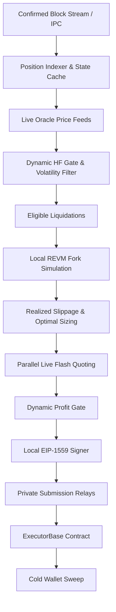

# Architecture

*Deep technical specification of the Corvus multi-chain liquidation engine, execution pipeline, and risk controls.*

Corvus is a specialized protocol liquidation system operating across 10 EVM chains. It enforces zero capital-at-risk execution by borrowing debt capital via uncollateralized flash loans, liquidating underwater borrow positions, swapping seized collateral back to the borrowed asset, and repaying the flash loan in a single atomic transaction.



## System Topology

```
corvus/
├── bot/
│   ├── config/             # Multi-chain TOML configurations
│   └── src/
│       ├── chains/         # Chain-specific adapters & registry
│       │   ├── aave_v3_standard/ # Standard Aave V3 multi-chain adapter
│       │   ├── base/       # Base Aave V3, Morpho Blue, Aerodrome
│       │   ├── ethereum/   # Spark, Aave V3 SVR exclusion
│       │   ├── hyperevm/   # HyperLend, HyperCore client, HyperSwap
│       │   └── plasma/     # Plasma specialized zero-DEX adapter
│       ├── flash/          # Balancer, Morpho, Aave, HyperLend flash adapters
│       ├── swap/           # DEX adapters (UniV3, Curve, Aerodrome, etc.)
│       ├── shared/         # REVM engine, gas oracle, mempool monitor
│       └── strategies/     # Dynamic liquidation dispatch & sizing
├── contracts/
│   └── src/
│       ├── ExecutorBase.sol # Unified multi-chain flash execution engine
│       └── interfaces/     # Protocol interfaces (Aave, Morpho, Balancer, etc.)
├── monitoring/             # Prometheus metrics and Grafana dashboards
├── scripts/                # Verification, deployment, and sweep utilities
└── docs/                   # Extended documentation and formal whitepaper
```

## Trait Architecture

Corvus decouples protocol mechanics from chain execution using three core traits:

### 1. LendingMarketAdapter

Defines position filtering, health factor evaluation, and calldata construction:

```rust
#[async_trait]
pub trait LendingMarketAdapter: Send + Sync {
    fn id(&self) -> &'static str;
    fn oracle_kind(&self) -> OracleKind;
    async fn refresh_positions(&self) -> Result<()>;
    async fn positions_below_hf(&self, threshold: f64) -> Vec<BorrowPosition>;
    async fn build_liquidation_calldata(
        &self,
        pos: &BorrowPosition,
        route: SwapRoute,
        min_profit: U256,
    ) -> Result<Bytes>;
}
```

- **Safety Gate:** Registration explicitly rejects any market reporting `OracleKind::SpotAmm` at boot to prevent atomic price manipulation exploits.

### 2. FlashLoanAdapter

Standardizes parallel depth and fee quoting across flash providers:

```rust
#[async_trait]
pub trait FlashLoanAdapter: Send + Sync {
    fn id(&self) -> &'static str;
    async fn max_flash_loan(&self, token: Address) -> Result<U256>;
    async fn quote_fee(&self, token: Address, amount: U256) -> Result<U256>;
    async fn build_flash_call(&self, token: Address, amount: U256, params: Bytes) -> Result<Bytes>;
}
```

### 3. SwapVenueAdapter

Provides venue-agnostic quote derivation and swap calldata generation:

```rust
#[async_trait]
pub trait SwapVenueAdapter: Send + Sync {
    fn id(&self) -> &'static str;
    async fn quote(&self, token_in: Address, token_out: Address, amount_in: U256) -> Result<U256>;
    async fn build_swap_calldata(&self, token_in: Address, token_out: Address, amount_in: U256, min_out: U256) -> Result<Bytes>;
}
```

## Dynamic Threshold Engine

All operational thresholds are computed continuously per block:

### 1. Dynamic Minimum Profit Gate
Static profit floors fail during fee spikes and leave profit on the table during cheap gas regimes. Corvus computes minimum acceptable profit per trade:

$$\text{Profit}_{\min}(t) = C_{\text{gas}}(t) \cdot \gamma + C_{\text{opp}}$$

Where:
- $C_{\text{gas}}(t)$ is the estimated gas cost in USD derived from current base fee and live native token oracle prices.
- $\gamma$ is the safety margin (default $1.25$).
- $C_{\text{opp}}$ is the configurable opportunity cost floor.

### 2. Realized Swap Slippage
Instead of applying a flat haircut, the engine evaluates virtual reserves and liquidity depth in the target pool:

$$S(x) = \frac{x}{x + R_v}$$

The realized discount is factored directly into net profit calculations before submitting transactions.

### 3. Volatility-Widened Health Factor Gate
During rapid market movements, liquidation competition intensifies. Corvus monitors rolling standard deviations of oracle updates ($\sigma$) and widens the search gate:

$$HF_{\text{gate}} = HF_{\text{base}} + \min(\sigma \cdot \alpha, \Delta_{\max})$$

This permits early pre-simulation and routing before positions cross into insolvency.

### 4. Adaptive Circuit Breaker
Reverts on expensive L1 chains threaten profitability far more than sub-cent L2 reverts. The adaptive breaker weights revert penalties by realized gas loss:

$$P = \min\left(5, 1 + \frac{\text{Loss}_{\text{USD}}}{5}\right)$$

Breakers trip when the accumulated loss or weighted penalty exceeds threshold limits, resetting after 3 consecutive successful transactions.

## Smart Contract Architecture

The system executes through `ExecutorBase.sol`, deployed identically across all chains.

### Flash Callback Branches
`ExecutorBase` routes four flash loan callback interfaces into a single shared internal execution routine:

1. **Balancer V2/V3:** `receiveFlashLoan(IERC20[], uint256[], uint256[], bytes)`
2. **Aave V3 Single-Asset:** `executeOperation(address, uint256, uint256, address, bytes)`
3. **Morpho Blue:** `onMorphoFlashLoan(uint256, bytes)`
4. **HyperLend Native:** `executeOperation(address[], uint256[], uint256[], address, bytes)`

### Core Invariants
- **Non-Reentrant:** All execution paths are locked against reentrancy.
- **Whitelist Enforcement:** Interactions are restricted to pre-approved lending pools and swap routers.
- **Zero Standing Allowances:** Router token approvals are explicitly cleared to zero following every swap.
- **Solvency Gate:** Reverts unconditionally if post-swap balances cannot cover flash debt plus accrued premiums.
- **Automatic Cold Sweep:** Net realized profits are swept to the immutable cold wallet in the same transaction.

## Private Submission Architecture

Transactions bypass public mempools across supported chains to prevent copycat searchers and front-running:

| Chain | Submission Mode | Relay Channel |
|---|---|---|
| Ethereum | Private | Flashbots Protect / MEV-Share |
| Arbitrum | Private | Arbitrum Timeboost native ordering |
| Polygon | Private | Polygon Bor Private Mempool |
| Base | Private | Alchemy MEV-Protected RPC |
| BNB Chain | Private | bloXroute MEV Relay |
| Other Chains | Direct Sequencer | Direct sequencer RPC endpoint |
