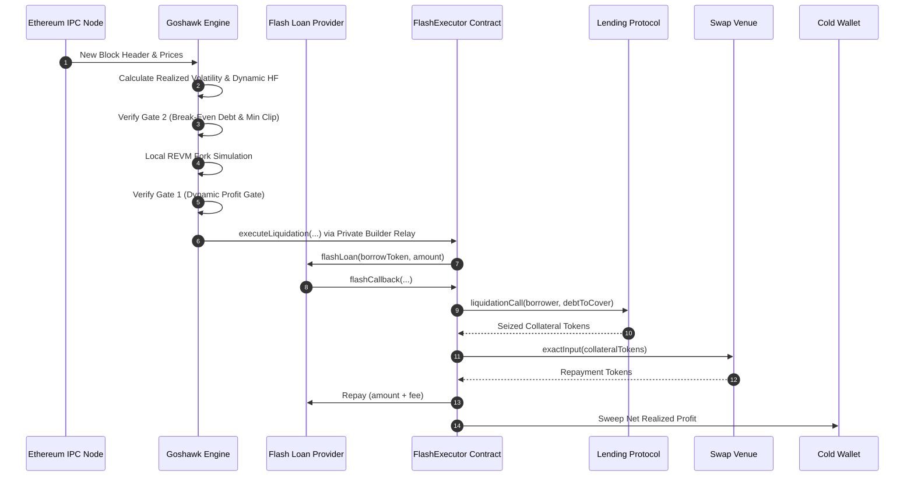

# Goshawk: Autonomous Ethereum Protocol Liquidation Engine

*Protocol Specification and Algorithmic Design*  
*Version 1.0 — September 2026*  
*Goshawk Engineering Working Group*

## Abstract

Decentralized lending protocols rely on external liquidators to maintain solvency by closing undercollateralized borrow positions in exchange for a liquidation penalty. Traditional liquidation systems employ static risk parameters, public mempool propagation, and sequential execution paths. Under volatile market conditions on Ethereum Mainnet, these systems suffer from gas-negative execution during base fee spikes, transaction front-running by copycat searchers, and suboptimal capital utilization across fragmented liquidity pools. 

This paper presents Goshawk, an autonomous protocol liquidation engine operating on Ethereum Mainnet (Chain ID 1). Goshawk replaces heuristic thresholds with live economic computations, introduces volatility-widened position monitoring, computes realized swap slippage from live virtual reserves, enforces dual independent economic hurdles, and routes transactions exclusively through private builder auction channels (Flashbots, Titan, Beaver). Transactions execute atomically via uncollateralized flash loans through a unified smart contract architecture (`FlashExecutor` / `ExecutorBase`), guaranteeing zero capital-at-risk.

## 1. Motivation and Background

Overcollateralized lending markets on Ethereum (such as Aave V3, Morpho Blue, Spark, Fluid, Compound V3, and Euler V2) enforce protocol solvency through the health factor metric $HF$:

$$HF = \frac{\sum (C_i \cdot P_i \cdot LT_i)}{\sum (D_j \cdot P_j)} \quad (1)$$

When $HF < 1.0$, third-party liquidators are permitted to repay a fraction of the debt $D$ in exchange for seizing equivalent collateral $C$ valued at a bonus factor $1 + \beta$, where $\beta$ is the liquidation incentive (typically $3\% - 10\%$).

### Limitations of Prior Approaches

1. **Static Minimum Profit Floors:** Conventional systems enforce flat USD profit hurdles. When transaction gas costs spike during chain congestion on Ethereum L1, fixed profit gates accept transactions whose execution cost exceeds realized revenues, creating net negative returns. Conversely, during low-fee periods, fixed floors discard profitable micro-liquidations.
2. **Pessimistic Static Haircuts:** Existing bots impose arbitrary discounts on seized collateral to anticipate slippage. In deep liquidity pools, this rejects viable transactions; in thin pools, static discounts under-penalize market impact, resulting in on-chain reverts.
3. **Public Mempool Exposure:** Broadcasting unhedged liquidation transactions into public mempools permits generalized front-runners to extract the opportunity by copying calldata and bidding an incremental priority fee.
4. **Single-Gate Fragility:** Systems relying solely on profit estimation frequently execute positions whose total debt is too small to clear protocol break-even floors during execution latency.

## 2. Design Overview

Goshawk addresses these inefficiencies through an integrated off-chain evaluation pipeline and a unified on-chain execution contract.

## 3. Mathematical and Mechanism Specification

### 3.1 Dual Independent Gate Conditions

Goshawk enforces two separate, non-waivable gates before dispatching an on-chain transaction:

#### Gate 1: Profit Hurdle
$$\Pi_{\text{sim}} \ge \max\left(C_{\text{gas}}(t) \cdot \gamma + C_{\text{opp}}, \text{Floor}_{\text{flat}}\right) \quad (2)$$

Where:
- $C_{\text{gas}}(t) = G_{\text{est}} \cdot P_{\text{base}}(t) \cdot P_{\text{native}}(t)$ is the real-time transaction fee in USD.
- $G_{\text{est}}$ is the execution gas estimate obtained from local REVM simulation.
- $P_{\text{base}}(t)$ is the live effective gas price.
- $\gamma \ge 1.0$ is the safety margin (default $1.15$).
- $C_{\text{opp}}$ is the baseline opportunity cost floor (default $\$15.00$).
- $\text{Floor}_{\text{flat}}$ is the flat floor (default $\$750.00$).

#### Gate 2: Protocol Break-Even Debt and Clip Sizing
$$\text{Debt}_{\text{USD}} \ge \text{BreakEvenDebt}_{\text{protocol}} \quad \land \quad \text{Debt}_{\text{USD}} \ge \text{MinClip}_{\text{protocol}} \quad (3)$$

Break-even thresholds per protocol:
- **Morpho Blue:** $\$900.00$
- **Compound V3:** $\$1{,}200.00$
- **Spark:** $\$2{,}333.33$
- **Aave V3:** $\$2{,}700.00$ (under Normal regime; under Spike regime $>60 \text{ gwei}$, $\$5{,}600.00$ with $\$25{,}000$ clip for WBTC)

### 3.2 Realized Slippage from Virtual Reserves

Goshawk computes expected market impact $S(x)$ directly from live AMM liquidity state:

$$S(x) = \frac{x}{x + R_v} \quad (4)$$

Where $x$ is the seized collateral volume and $R_v$ is the effective virtual reserve of the target pool. Net liquidation revenue is then calculated as:

$$\Pi_{\text{gross}} = D \cdot \left(\beta - S(x)\right) \cdot \phi \quad (5)$$

Where $\phi$ is the collateral safety factor (default $0.90$).

### 3.3 Volatility-Widened Position Filtering

To capture liquidation candidates in high-velocity markets before competing searchers, Goshawk monitors the rolling realized return volatility $\sigma$ over a window of $N = 50$ updates:

$$\sigma = \sqrt{\frac{1}{N-1} \sum_{i=1}^N \left(r_i - \bar{r}\right)^2}, \quad r_i = \frac{P_i - P_{i-1}}{P_{i-1}} \quad (6)$$

The health factor threshold $HF_{\text{gate}}$ expands dynamically:

$$HF_{\text{gate}} = HF_{\text{base}} + \min(\sigma \cdot \alpha, \Delta_{\max}) \quad (7)$$

Where $HF_{\text{base}} = 1.03$, $\alpha = 1.50$, and $\Delta_{\max} = 0.05$.

### 3.4 Adaptive Cost-Weighted Circuit Breakers

To guard against unexpected market pauses or re-entrancy anomalies, Goshawk tracks both failure count $k$ and cumulative realized gas expenditure:

$$\Omega(k) = \sum_{i=1}^k \left(1 + \min\left(5, \frac{C_{\text{gas}, i}}{\kappa}\right)\right) \quad (8)$$

Where $\kappa = \$5.00$. On Ethereum Mainnet ($C_{\text{gas}} \approx \$30.00 - \$100.00$), a revert incurs the maximum penalty of $6$, tripping the circuit breaker within 2 successive failures.

### 3.5 Lowest-Fee Parallel Flash Provider Selection

For borrow asset $A$ and principal amount $L$, Goshawk queries depth and fees across providers in strict priority order:
1. **Morpho Blue:** $0.00\%$ fee
2. **Balancer V2:** $0.00\%$ fee
3. **Spark DSS Flash:** $0.00\%$ fee
4. **Aave V3:** $0.05\%$ fee (liquidity backstop)

## 4. Formal Properties and Invariants

### Invariant 1: No Capital at Risk
Let $B_{\text{contract}}(t)$ denote the token balances held by `FlashExecutor`.
$$\forall t, \quad B_{\text{contract}}(t) = 0 \quad (9)$$
The contract holds no standing funds between blocks. All operational capital is acquired and liquidated within atomic flash loan execution.

### Invariant 2: Solvency and Repayment Guarantee
Let $L$ be the principal borrowed and $\Theta$ be the provider fee.
$$B_{\text{repay}} \ge L + \Theta \quad (10)$$
If equation (10) is violated following collateral liquidation and swap, the execution contract invokes an unconditional revert, unwinding all state modifications.

### Invariant 3: Front-Running Immunity
Transactions routed through private builder auction relays (Flashbots, Titan, Beaver) bypass the public mempool:
$$\mathbb{P}(\text{Mempool Leakage}) = 0 \quad (11)$$

## 5. Parameter Specification

| Symbol | Parameter | Scope | Default |
|---|---|---|---|
| $\gamma$ | `gas_estimate_safety_margin` | Global | `1.15` |
| $C_{\text{opp}}$ | `opportunity_cost_usd` | Ethereum | `$15.00` |
| $\text{Floor}_{\text{flat}}$ | `min_liquidation_profit_usd` | Ethereum | `$750.00` |
| $HF_{\text{base}}$ | `hf_threshold` | Ethereum | `1.03` |
| $\alpha$ | `volatility_scale` | Ethereum | `1.50` |
| $\Delta_{\max}$ | `max_hf_widening` | Ethereum | `0.05` |
| $\phi$ | `liquidation_safety_factor` | Ethereum | `0.90` |
| $\Omega_{\max}$ | `circuit_breaker_threshold` | Ethereum | `10` |

## 6. Conclusion

Goshawk demonstrates that replacing static risk parameters with continuous, market-aware computations eliminates execution insolvency risks while expanding captured liquidation volume on Ethereum Mainnet. By uniting parallel off-chain simulation with an audited, single-contract on-chain core and dual independent economic gates, the engine achieves high capital efficiency and complete front-running immunity.

## References

1. Aave Protocol. *Aave V3 Technical Whitepaper*. 2022.
2. Adams, H. et al. *Uniswap v3 Core*. 2021.
3. Morpho Association. *Morpho Blue Whitepaper*. 2023.
4. Daian, P. et al. *Flash Boys 2.0: Frontrunning, Transaction Reordering, and Consensus Instability in Decentralized Exchanges*. arXiv:1904.05234, 2019.
