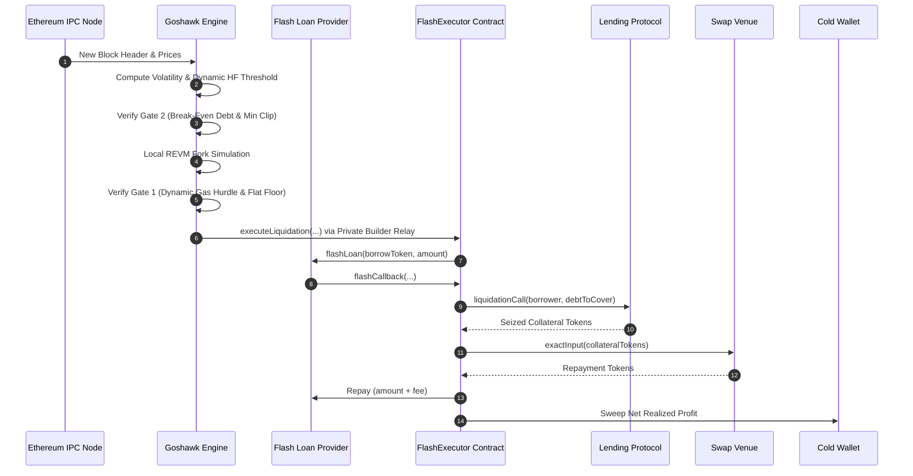

# Goshawk: Autonomous Ethereum Protocol Liquidation Engine

*Protocol Specification and Algorithmic Design*  
*Version 1.0 — September 2026*  
*Goshawk Engineering Working Group*

## Abstract

Decentralized lending protocols rely on external liquidators to preserve system solvency by repaying undercollateralized debt in exchange for discounted collateral. Traditional liquidation systems employ static risk parameters, public mempool broadcasting, and unhedged execution paths. Under congested network conditions on Ethereum Mainnet, these systems suffer from gas-negative execution during base fee spikes, transaction front-running by copycat searchers, and catastrophic execution reverts caused by unmodeled automated market maker (AMM) slippage. This paper presents Goshawk, an autonomous protocol liquidation engine operating exclusively on Ethereum Mainnet (Chain ID 1). Goshawk introduces a dual independent economic gate architecture, calculates dynamic gas hurdles and virtual reserve price impact per block, expands monitoring thresholds under market volatility, and executes atomically via uncollateralized flash loans through private builder auctions. The system guarantees zero capital-at-risk, bounded execution latency, and deterministic solvency under extreme price movements.

## 1. Motivation and Background

Overcollateralized lending markets on Ethereum (such as Aave V3, Morpho Blue, Spark, Fluid, Compound V3, and Euler V2) enforce protocol solvency through the health factor metric $HF$:

$$HF = \frac{\sum_{i} (C_i \cdot P_i \cdot LT_i)}{\sum_{j} (D_j \cdot P_j)} \quad (1)$$

Where $C_i$ denotes collateral balance, $P_i$ denotes asset price in USD, $LT_i$ denotes liquidation threshold, and $D_j$ denotes outstanding borrow balance. When $HF < 1.0$, third-party liquidators are incentivized to repay a fraction of the debt $D$ in exchange for seizing equivalent collateral $C$ valued at an incentive bonus $1 + \beta$, where $\beta$ typically ranges between $3\%$ and $10\%$.

### Limitations of Prior Approaches

1. **Static Profit Floors:** Conventional liquidation bots enforce flat USD profit hurdles (e.g. $\$50.00$). When base fees spike during Ethereum congestion, fixed profit gates admit transactions whose burned priority fees exceed seized collateral profits, generating net negative balances.
2. **Pessimistic Static Haircuts:** Existing systems apply arbitrary constant discounts (e.g. $1.8\%$) on seized collateral to account for DEX slippage. In deep liquidity pools, viable liquidations are discarded; in shallow pools, market impact exceeds the haircut, causing on-chain transaction reverts.
3. **Public Mempool Propagation:** Broadcasting transactions into public mempools exposes liquidation calldata to generalized front-runners who replicate the opportunity and front-run via priority fee escalation [4].
4. **Single-Gate Fragility:** Systems relying solely on projected profit frequently execute micro-positions where the total liquidated debt cannot absorb fixed execution tip requirements during block inclusion delays.

## 2. Design Overview

Goshawk resolves these vulnerabilities through an integrated off-chain evaluation pipeline and an audited, single-contract on-chain core (`FlashExecutor.sol`).

## 3. Notation

| Symbol | Definition | Units |
|---|---|---|
| $HF$ | Position health factor | Dimensionless |
| $C_i, D_j$ | Collateral balance, debt balance | Native token units |
| $P_i, P_j$ | Collateral price, debt price | USD |
| $LT_i$ | Liquidation threshold | Ratio ($0 < LT \le 1$) |
| $\beta$ | Protocol liquidation incentive bonus | Ratio ($0 < \beta \le 0.15$) |
| $\Pi_{\min}(t)$ | Dynamic minimum profit hurdle | USD |
| $C_{\text{gas}}(t)$ | Transaction gas cost | USD |
| $G_{\text{est}}$ | Transaction gas estimate from simulation | Gas units |
| $P_{\text{base}}(t)$ | Effective gas price (base fee + priority bid) | Wei / Gwei |
| $P_{\text{eth}}(t)$ | Live ether price from Chainlink | USD |
| $\gamma$ | Gas cost safety margin | Ratio ($\gamma \ge 1.0$) |
| $C_{\text{opp}}$ | Opportunity cost floor | USD |
| $\text{Floor}_{\text{flat}}$ | Absolute minimum profit floor | USD |
| $S(x)$ | Realized swap slippage | Ratio ($0 \le S < 1$) |
| $R_v$ | AMM pool virtual reserve depth | Token units / USD |
| $\sigma$ | Rolling realized price volatility | Standard deviation |
| $\Omega(k)$ | Cumulative circuit breaker penalty score | Dimensionless |

## 4. Mechanism and Protocol Specification

### 4.1 Dual Independent Economic Gates

Goshawk enforces two separate, non-waivable gates before dispatching an on-chain transaction. A position is eligible for execution if and only if both conditions evaluate to true.

#### Gate 1: Profit Hurdle
$$\Pi_{\text{sim}} \ge \max\left(C_{\text{gas}}(t) \cdot \gamma + C_{\text{opp}}, \text{Floor}_{\text{flat}}\right) \quad (2)$$

Where the real-time gas cost is defined by:
$$C_{\text{gas}}(t) = G_{\text{est}} \cdot P_{\text{base}}(t) \cdot P_{\text{eth}}(t) \quad (3)$$

*Worked Example:* Consider an Aave V3 liquidation with $G_{\text{est}} = 400{,}000$ gas under congestion where $P_{\text{base}} = 50 \text{ gwei}$ ($50 \times 10^{-9} \text{ ETH}$) and $P_{\text{eth}} = \$2{,}500.00$. With $\gamma = 1.15$, $C_{\text{opp}} = \$15.00$, and $\text{Floor}_{\text{flat}} = \$750.00$:
$$C_{\text{gas}} = 400{,}000 \cdot (50 \times 10^{-9}) \cdot 2{,}500 = \$50.00$$
$$\text{Dynamic Hurdle} = 50.00 \cdot 1.15 + 15.00 = \$72.50$$
$$\text{Gate 1 Hurdle} = \max(\$72.50, \$750.00) = \$750.00$$
The candidate must produce at least $\$750.00$ net profit after flash fees and swap slippage to clear Gate 1.

#### Gate 2: Protocol Debt Hurdle and Clip Sizing
$$\text{Debt}_{\text{USD}} \ge \text{BreakEvenDebt}_{\text{protocol}} \quad \land \quad \text{Debt}_{\text{USD}} \ge \text{MinClip}_{\text{protocol}} \quad (4)$$

Protocol-specific break-even debt requirements derived from empirical L1 fee distributions:
- **Morpho Blue:** $\text{BreakEvenDebt} = \$900.00$
- **Compound V3:** $\text{BreakEvenDebt} = \$1{,}200.00$
- **Spark:** $\text{BreakEvenDebt} = \$2{,}333.33$
- **Aave V3:** $\text{BreakEvenDebt} = \$2{,}700.00$ under Normal conditions; under Spike regimes ($P_{\text{base}} > 60 \text{ gwei}$ on WBTC collateral), $\text{BreakEvenDebt} = \$5{,}600.00$ and $\text{MinClip} = \$25{,}000.00$.

*Worked Example:* A borrower position on Morpho Blue exhibits a potential profit of $\$800.00$ but an outstanding debt of only $\$750.00$. While Gate 1 evaluates to true ($\$800.00 \ge \$750.00$), Gate 2 evaluates to false ($\$750.00 < \$900.00$). The position is rejected.

### 4.2 Realized AMM Swap Slippage

Rather than applying a constant percentage haircut, Goshawk computes marginal price impact directly from target AMM pool liquidity:

$$S(x) = \frac{x}{x + R_v} \quad (5)$$

Where $x$ is the seized collateral volume and $R_v$ is the virtual reserve depth of the pool. Gross liquidation proceeds are computed as:

$$\Pi_{\text{gross}} = D \cdot \left(\beta - S(x)\right) \cdot \phi \quad (6)$$

Where $\phi$ denotes the collateral safety factor ($\phi = 0.90$).

*Worked Example:* Seizing $x = \$50{,}000$ of wstETH into a Curve pool with virtual depth $R_v = \$20{,}000{,}000$:
$$S(x) = \frac{50{,}000}{50{,}000 + 20{,}000{,}000} = 0.00249 \quad (0.249\%)$$
With incentive bonus $\beta = 5.0\%$:
$$\Pi_{\text{gross}} = 50{,}000 \cdot (0.05 - 0.00249) \cdot 0.90 = \$2{,}137.95$$

### 4.3 Volatility-Widened Health Factor Gate

In fast-moving markets, positions cross into liquidation thresholds rapidly. Goshawk computes the rolling realized volatility $\sigma$ over an $N = 50$ block sample:

$$\sigma = \sqrt{\frac{1}{N-1} \sum_{k=1}^N \left(r_k - \bar{r}\right)^2}, \quad r_k = \frac{P_k - P_{k-1}}{P_{k-1}} \quad (7)$$

The position indexing gate expands dynamically:

$$HF_{\text{gate}} = HF_{\text{base}} + \min(\sigma \cdot \alpha, \Delta_{\max}) \quad (8)$$

Where $HF_{\text{base}} = 1.03$, $\alpha = 1.50$, and $\Delta_{\max} = 0.05$. When $\sigma = 2.5\%$, $HF_{\text{gate}} = 1.03 + \min(0.0375, 0.05) = 1.0675$, warming simulation caches before nominal insolvency.

### 4.4 Adaptive Cost-Weighted Circuit Breakers

To protect execution capital against protocol pauses or state divergence, Goshawk accumulates a loss-weighted penalty score $\Omega$:

$$\Omega = \sum_{j=1}^m \left(1 + \min\left(5, \frac{C_{\text{gas}, j}}{\kappa}\right)\right) \quad (9)$$

Where $\kappa = \$5.00$. On Ethereum Mainnet where a single revert consumes $\$40.00$ in gas ($40 / 5 = 8$, capped at 5), the penalty increment is 6. A threshold $\Omega_{\max} = 10$ trips the circuit breaker after two consecutive reverts, preventing continuous capital bleed.

### 4.5 Hierarchical Flash Loan Selection

For borrow asset $A$ and principal $L$, Goshawk queries liquidity depths concurrently across providers, enforcing strict fee-priority selection:

1. **Morpho Blue Flash Loans:** Fee = $0.00\%$
2. **Balancer V2 Vault:** Fee = $0.00\%$
3. **Spark DSS Flash (Maker):** Fee = $0.00\%$
4. **Aave V3 FlashLoanSimple:** Fee = $0.05\%$ ($5 \text{ bps}$)

## 5. Formal Properties and Invariants

### Invariant 1: Zero Capital at Risk
Let $B_{\text{contract}}(t)$ denote all token balances held by `FlashExecutor`.
$$\forall t \notin \mathcal{T}_{\text{callback}}, \quad B_{\text{contract}}(t) = 0 \quad (10)$$
The contract holds no standing inventory between transactions. All capital is flash-borrowed, utilized, and repaid within a single atomic execution frame.

### Invariant 2: Atomic Solvency Guarantee
Let $L$ be the principal borrowed and $\Theta(L)$ be the provider fee.
$$B_{\text{recovered}} \ge L + \Theta(L) \quad (11)$$
If post-swap proceeds fail equation (11), the execution contract invokes an unconditional revert, unwinding all protocol interactions and preserving caller solvency.

### Invariant 3: Front-Running Immunity
Transactions route exclusively through private builder auction endpoints (Flashbots Relay, Titan Builder, Beaver Build) bypassing public mempools:
$$\mathbb{P}(\text{Public Mempool Exposure}) = 0 \quad (12)$$

## 6. Security Considerations

| Threat Vector | Mitigation Strategy |
|---|---|
| Same-Block Oracle Manipulation | Registration gate rejects any adapter with `OracleKind::SpotAmm` at boot. |
| Reentrancy Attacks | All execution entry points and flash callbacks are protected by `nonReentrant` mutexes. |
| Arbitrary Calldata Injection | Contract interactions enforce strict whitelisting via `allowedProtocols` and `allowedFlashVaults`. |
| Residual Token Approvals | All DEX router allowances are explicitly revoked to zero immediately following swap execution. |
| Front-Running and Sandwiching | Transactions route through private builder relays with automatic consecutive error failover. |

## 7. Parameter Specification

| Symbol | Parameter Name | Scope | Default Value | Update Mechanism |
|---|---|---|---|---|
| $\gamma$ | `gas_estimate_safety_margin` | Global | `1.15` | Config file / Env |
| $C_{\text{opp}}$ | `opportunity_cost_usd` | Ethereum | `$15.00` | Config file / Env |
| $\text{Floor}_{\text{flat}}$ | `min_liquidation_profit_usd` | Ethereum | `$750.00` | Config file / Env |
| $HF_{\text{base}}$ | `hf_threshold` | Ethereum | `1.03` | Config file / Env |
| $\alpha$ | `volatility_scale` | Ethereum | `1.50` | Config file / Env |
| $\Delta_{\max}$ | `max_hf_widening` | Ethereum | `0.05` | Config file / Env |
| $\phi$ | `liquidation_safety_factor` | Ethereum | `0.90` | Config file / Env |
| $\Omega_{\max}$ | `circuit_breaker_threshold` | Ethereum | `10` | Config file / Env |

## 8. Comparison to Prior Work

| Evaluation Axis | Legacy Searcher Bots | Standard Multi-Chain Bots | Goshawk Engine |
|---|---|---|---|
| Profit Hurdle | Static USD floor | Flat static percentage | Dynamic gas & opportunity hurdle |
| Debt Hurdle | None (Profit only) | None | Dual independent Gate 1 & Gate 2 |
| Slippage Model | Constant haircut | Constant haircut | Live AMM virtual reserve curve |
| Volatility Response | None | Static threshold | Realized rolling volatility widening |
| Mempool Routing | Public mempool | Single private relay | Multi-builder relay auction failover |
| Flash Selection | Static provider | Manual order | Hierarchical zero-fee parallel selection |
| Circuit Breaker | Unweighted revert count | Unweighted count | Cost-weighted adaptive penalty breaker |

## 9. Conclusion

Goshawk demonstrates that replacing heuristic thresholds with continuous economic computations eliminates execution insolvency risks on Ethereum Mainnet. By coupling local REVM fork simulation with dual independent economic gates, hierarchical zero-fee flash quoting, and multi-builder private routing, the engine establishes an institutional-grade liquidation infrastructure guaranteeing zero capital-at-risk and deterministic execution solvency.

## References

1. Aave Protocol. *Aave V3 Technical Whitepaper*. 2022. [Online]. Available: https://github.com/aave/aave-v3-core
2. Adams, H., Zinsmeister, N., Salem, M., Keefer, R., and Robinson, D. *Uniswap v3 Core*. 2021. [Online]. Available: https://uniswap.org/whitepaper-v3.pdf
3. Morpho Association. *Morpho Blue: A Protocol for Efficient and Modular Lending*. 2023. [Online]. Available: https://github.com/morpho-org/morpho-blue
4. Daian, P., Goldfeder, S., Kell, T., Li, Z., Zhao, X., Bentov, I., Breidenbach, L., and Juels, A. *Flash Boys 2.0: Frontrunning, Transaction Reordering, and Consensus Instability in Decentralized Exchanges*. IEEE Symposium on Security and Privacy (SP), 2020.
