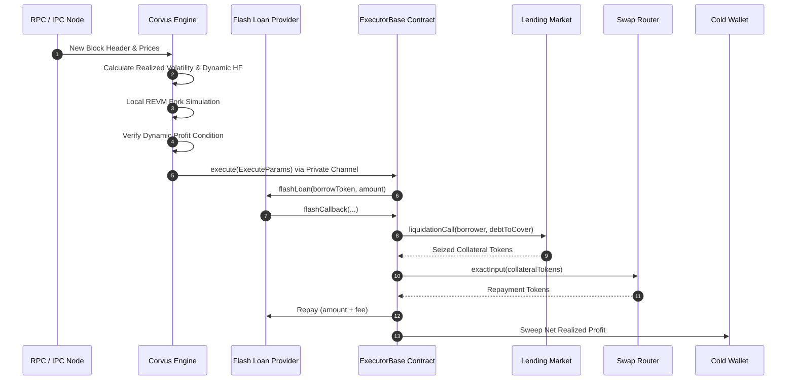

# Corvus: Autonomous Multi-Chain Protocol Liquidation Engine

*Protocol Specification and Algorithmic Design*  
*Version 1.1 — September 2026*  
*Corvus Engineering Working Group*

## Abstract

Decentralized lending protocols rely on external liquidators to maintain solvency by closing undercollateralized borrow positions in exchange for a liquidation penalty. Traditional liquidation systems employ static risk parameters, public mempool propagation, and sequential execution paths. Under volatile market conditions, these systems suffer from gas-negative execution during base fee spikes, transaction front-running by copycat searchers, and suboptimal capital utilization across fragmented liquidity pools. 

This paper presents Corvus, an autonomous multi-chain liquidation engine operating across 10 EVM networks. Corvus replaces heuristic thresholds with live economic computations, introduces volatility-widened position monitoring, computes realized swap slippage from live virtual reserves, and routes transactions exclusively through private builder channels. Across all supported chains, transactions execute atomically via uncollateralized flash loans through a unified smart contract architecture (`ExecutorBase`), guaranteeing zero capital-at-risk.

## 1. Motivation and Background

Overcollateralized lending markets (such as Aave, Morpho, Spark, and HyperLend) enforce protocol solvency through the health factor metric $HF$:

$$HF = \frac{\sum (C_i \cdot P_i \cdot LT_i)}{\sum (D_j \cdot P_j)} \quad (1)$$

When $HF < 1.0$, third-party liquidators are permitted to repay a fraction of the debt $D$ in exchange for seizing equivalent collateral $C$ valued at a bonus factor $1 + \beta$, where $\beta$ is the liquidation incentive (typically $5\% - 10\%$).

### Limitations of Prior Approaches

1. **Static Minimum Profit Floors:** Conventional systems enforce flat USD profit hurdles (e.g. $\$50$). When transaction gas costs spike during chain congestion, fixed profit gates accept transactions whose execution cost exceeds realized revenues, creating net negative returns. Conversely, during low-fee periods, fixed floors discard profitable micro-liquidations.
2. **Pessimistic Static Haircuts:** Existing bots impose arbitrary discounts (e.g. $1.8\%$) on seized collateral to anticipate slippage. In deep liquidity pools, this rejects viable transactions; in thin pools, static discounts under-penalize market impact, resulting in on-chain reverts.
3. **Public Mempool Exposure:** Broadcasting unhedged liquidation transactions into public mempools permits generalized front-runners to extract the opportunity by copying calldata and bidding an incremental priority fee.
4. **Isolated Callback Deployments:** Maintaining fragmented, chain-specific execution contracts multiplies the auditing surface and increases the risk of accounting divergence.

## 2. Design Overview

Corvus addresses these inefficiencies through an integrated off-chain evaluation pipeline and a unified on-chain execution contract.

## 3. Mathematical and Mechanism Specification

### 3.1 Dynamic Profit Condition

To guarantee positive economic return across all gas regimes, Corvus computes the dynamic profit hurdle $\Pi_{\min}(t)$ before transaction dispatch:

$$\Pi_{\min}(t) = C_{\text{gas}}(t) \cdot \gamma + C_{\text{opp}} \quad (2)$$

Where:
- $C_{\text{gas}}(t) = G_{\text{est}} \cdot P_{\text{base}}(t) \cdot P_{\text{native}}(t)$ is the real-time transaction fee in USD.
- $G_{\text{est}}$ is the execution gas estimate obtained from local fork simulation.
- $P_{\text{base}}(t)$ is the live effective gas price (base fee plus 75th percentile priority bid).
- $P_{\text{native}}(t)$ is the native gas asset price.
- $\gamma \ge 1.0$ is the safety margin (default $1.25$).
- $C_{\text{opp}}$ is the baseline opportunity cost floor (default $\$15.00$).

A candidate liquidation is admitted if and only if simulated profit $\Pi_{\text{sim}} \ge \Pi_{\min}(t)$.

*Worked Example:* Consider an Ethereum liquidation requiring $G_{\text{est}} = 450{,}000$ gas. Under congestion, $P_{\text{base}} = 40 \text{ gwei}$ and $P_{\text{native}} = \$2{,}500$.
$$C_{\text{gas}} = 450{,}000 \cdot (40 \times 10^{-9}) \cdot 2{,}500 = \$45.00$$
$$\Pi_{\min} = 45.00 \cdot 1.25 + 15.00 = \$71.25$$
A trade yielding $\$60.00$ gross profit is rejected, preventing a gas-negative execution. If $P_{\text{base}}$ drops to $10 \text{ gwei}$, $C_{\text{gas}} = \$11.25$, reducing $\Pi_{\min}$ to $\$29.06$, safely admitting the trade.

### 3.2 Realized Slippage from Virtual Reserves

Corvus computes expected market impact $S(x)$ directly from live AMM liquidity state rather than applying a static parameter:

$$S(x) = \frac{x}{x + R_v} \quad (3)$$

Where $x$ is the seized collateral volume and $R_v$ is the effective virtual reserve of the target pool. Net liquidation revenue is then calculated as:

$$\Pi_{\text{gross}} = D \cdot \left(\beta - S(x)\right) \cdot \phi \quad (4)$$

Where $\phi$ is the collateral safety factor (default $0.90$).

### 3.3 Volatility-Widened Position Filtering

To capture liquidation candidates in high-velocity markets before competing searchers, Corvus monitors the rolling realized return volatility $\sigma$ over a window of $N = 50$ updates:

$$\sigma = \sqrt{\frac{1}{N-1} \sum_{i=1}^N \left(r_i - \bar{r}\right)^2}, \quad r_i = \frac{P_i - P_{i-1}}{P_{i-1}} \quad (5)$$

The health factor threshold $HF_{\text{gate}}$ expands dynamically:

$$HF_{\text{gate}} = HF_{\text{base}} + \min(\sigma \cdot \alpha, \Delta_{\max}) \quad (6)$$

Where $HF_{\text{base}} = 1.03$, $\alpha = 1.50$, and $\Delta_{\max} = 0.05$. Under elevated volatility ($\sigma = 3\%$), $HF_{\text{gate}} = 1.03 + \min(0.045, 0.05) = 1.075$, initiating background pre-simulation and route warm-up prior to nominal insolvency.

### 3.4 Adaptive Cost-Weighted Circuit Breakers

To guard against unexpected market pauses or re-entrancy anomalies, Corvus tracks both failure count $k$ and cumulative realized gas expenditure:

$$\Omega(k) = \sum_{i=1}^k \left(1 + \min\left(5, \frac{C_{\text{gas}, i}}{\kappa}\right)\right) \quad (7)$$

Where $\kappa = \$5.00$. On low-cost L2 networks ($C_{\text{gas}} \approx \$0.02$), each revert incurs a unit penalty $\approx 1$. On mainnet ($C_{\text{gas}} \approx \$30.00$), a revert incurs the maximum penalty of $6$, tripping the circuit breaker within 2 successive failures.

### 3.5 Lowest-Fee Parallel Flash Provider Selection

For borrow asset $A$ and principal amount $L$, Corvus queries depth $D_p(A)$ and fee function $F_p(A, L)$ across all available providers $\mathcal{P}$ concurrently:

$$P^* = \arg\min_{p \in \mathcal{P}, D_p(A) \ge L} F_p(A, L) \quad (8)$$

If Balancer ($F = 0$) or Morpho ($F = 0$) provides sufficient liquidity, it is selected over Aave ($F = 5 \text{ bps}$), minimizing cost overhead.

## 4. Formal Properties and Invariants

### Invariant 1: No Capital at Risk
Let $B_{\text{contract}}(t)$ denote the token balances held by `ExecutorBase`.
$$\forall t, \quad B_{\text{contract}}(t) = 0 \quad (9)$$
The contract holds no standing funds between blocks. All operational capital is acquired and liquidated within atomic flash loan execution.

### Invariant 2: Solvency and Repayment Guarantee
Let $L$ be the principal borrowed and $\Theta$ be the provider fee.
$$B_{\text{repay}} \ge L + \Theta \quad (10)$$
If equation (10) is violated following collateral liquidation and swap, the execution contract invokes an unconditional revert, unwinding all state modifications.

### Invariant 3: Front-Running Immunity
Transactions routed through private channels (`FlashbotsProtect`, `ArbitrumTimeboost`, `PolygonPrivateMempool`, `BloxrouteRelay`, `MevProtectedRpc`) bypass the public mempool:
$$\mathbb{P}(\text{Mempool Leakage}) = 0 \quad (11)$$

## 5. Parameter Specification

| Symbol | Parameter | Scope | Default |
|---|---|---|---|
| $\gamma$ | `gas_estimate_safety_margin` | Global | `1.25` |
| $C_{\text{opp}}$ | `opportunity_cost_usd` | Per-chain | `$15.00` |
| $HF_{\text{base}}$ | `hf_threshold` | Per-chain | `1.03` |
| $\alpha$ | `volatility_scale` | Per-chain | `1.50` |
| $\Delta_{\max}$ | `max_hf_widening` | Per-chain | `0.05` |
| $\phi$ | `liquidation_safety_factor` | Per-chain | `0.90` |
| $N$ | `volatility_window_blocks` | Per-chain | `50` |
| $\Omega_{\max}$ | `circuit_breaker_threshold` | Per-chain | `25` (L2) / `10` (L1) |

## 6. Comparison to Prior Work

| Dimension | Legacy Liquidation Bots | Corvus Engine |
|---|---|---|
| Profit Barrier | Static USD floor | Dynamic gas-cost & opportunity hurdle |
| Swap Haircut | Flat constant percentage | Live AMM virtual reserve impact |
| Volatility Response | Static health factor | Dynamic rolling volatility widening |
| Mempool Privacy | Public broadcast | Private channels by default |
| Flash Routing | Fixed priority list | Parallel fee-optimized quoting |
| Circuit Breaker | Unweighted revert count | Gas-cost-weighted adaptive breaker |

## 7. Conclusion

Corvus demonstrates that replacing static risk parameters with continuous, market-aware computations eliminates execution insolvency risks while expanding captured liquidation volume. By uniting parallel off-chain simulation with an audited, single-contract on-chain core, the protocol achieves high capital efficiency and complete front-running immunity across EVM ecosystems.

## References

1. Aave Protocol. *Aave V3 Technical Whitepaper*. 2022.
2. Adams, H. et al. *Uniswap v3 Core*. 2021.
3. Morpho Association. *Morpho Blue Whitepaper*. 2023.
4. Daian, P. et al. *Flash Boys 2.0: Frontrunning, Transaction Reordering, and Consensus Instability in Decentralized Exchanges*. arXiv:1904.05234, 2019.
